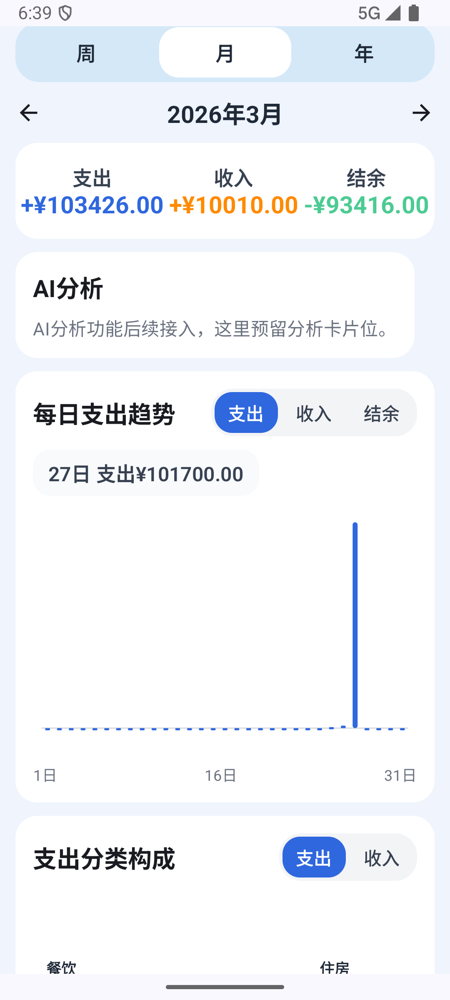
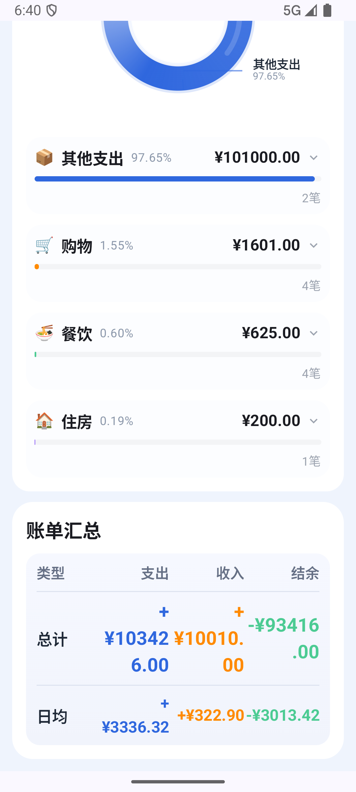

# 🍪 iCookie - 智能记账助手

一个基于 Android 原生开发的智能记账应用，采用现代化的模块化架构设计，支持 AI 辅助记账、交易导入、资产管理等核心功能。

---

## 📱 应用截图

<p align="center">
  
  
</p>

---

## 🏗️ 项目架构

本项目采用 **Clean Architecture** 结合 **模块化设计**，参考 Google 官方推荐的 Now in Android 架构模式。

### 模块结构

```
ai-finance-android/
├── app/                          # 应用入口模块
│   └── src/main/java/com/aifinance/app/
│       ├── MainActivity.kt       # 主Activity，集成侧边栏导航
│       └── navigation/
│           └── AiFinanceNavHost.kt   # 全局导航配置
│
├── core/                         # 核心层模块
│   ├── designsystem/            # UI设计系统（主题、颜色、字体）
│   ├── ui/                      # 通用UI组件
│   ├── model/                   # 数据模型定义
│   ├── database/                # Room数据库（实体、DAO）
│   └── data/                    # 数据仓库实现
│
├── feature/                      # 功能模块（按特性划分）
│   ├── home/                    # 首页 - 记账记录与AI助手
│   ├── transactions/            # 交易列表与详情
│   ├── add_transaction/         # 添加交易
│   ├── statistics/              # 统计分析
│   ├── settings/                # 设置页面
│   ├── ai/                      # AI功能模块（规划中）
│   ├── ocr/                     # OCR票据识别（规划中）
│   └── importer/                # 账单导入（规划中）
│
└── build-logic/                  # 构建逻辑（Convention插件）
    └── convention/
```

### 技术栈

| 层级 | 技术 |
|------|------|
| **UI** | Jetpack Compose + Material Design 3 |
| **架构** | MVVM + Repository Pattern |
| **依赖注入** | Hilt |
| **数据库** | Room (SQLite) |
| **导航** | Compose Navigation |
| **异步** | Kotlin Coroutines + Flow |
| **图片加载** | Coil |
| **动画** | Lottie Compose |

---

## ✨ 已实现功能

### 🏠 首页 (Home)
- **双页卡片轮播**：
  - 📊 净资产卡片（金色渐变）- 展示总资产、负债、净资产
  - 📈 月度支出卡片（蓝色渐变）- 展示当月收入、支出、结余
- **金额隐私保护**：一键隐藏/显示金额
- **交易时间线**：按日期分组展示交易记录
- **快速记账**：悬浮按钮一键记账
- **侧边栏导航**：左滑呼出菜单，快速切换页面

### 📝 交易管理
- **交易列表**：支持按月份筛选
- **交易详情**：点击交易查看/编辑详情
- **快速分类**：点击分类标签可直接修改分类
- **长按删除**：长按交易记录可删除
- **交易类型**：收入、支出、转账

### 📊 资产管理
- **资产卡片管理**
- **负债追踪**
- **净资产实时计算**

### 🎨 UI/UX 特性
- **玻璃拟态设计** (Glassmorphism)：毛玻璃效果卡片
- **流畅动画**：页面切换、交互动画
- **Material Design 3**：符合现代设计规范
- **响应式布局**：适配不同屏幕尺寸

---

## 🚧 开发中/规划功能

### AI 智能功能
- [ ] 🤖 **AI 记账助手**：自然语言输入自动识别金额、分类
- [ ] 🔍 **智能分类建议**：基于交易描述自动推荐分类
- [ ] 💡 **消费洞察**：AI 分析消费习惯，提供理财建议
- [ ] 📸 **票据 OCR 识别**：拍照识别发票、收据自动记账

### 数据导入
- [ ] 📥 **账单导入**：支持支付宝、微信、银行账单 CSV/Excel 导入
- [ ] 🔄 **批量处理**：智能去重、自动分类

### 统计分析
- [ ] 📊 **图表展示**：饼图、折线图、柱状图
- [ ] 📅 **周期分析**：按周、月、年统计
- [ ] 🏷️ **分类占比**：各分类支出占比分析
- [ ] 📈 **趋势预测**：基于历史数据预测未来支出

### 其他功能
- [ ] ☁️ **数据备份/恢复**
- [ ] 🔒 **本地加密存储**
- [ ] 🔔 **记账提醒**
- [ ] 🌙 **深色模式**

---

## 🛠️ 环境要求

- **Android Studio**: Hedgehog (2023.1.1) 或更高版本
- **Kotlin**: 1.9.22
- **minSdk**: 26 (Android 8.0)
- **targetSdk**: 34 (Android 14)
- **Java**: 17

---

## 🚀 快速开始

### 1. 克隆项目

```bash
git clone https://github.com/Karlineal/ai_finance_app.git
cd ai_finance_app
```

### 2. 使用 Android Studio 打开

- 打开 Android Studio
- 选择 `Open an existing project`
- 选择项目根目录

### 3. 构建并运行

- 点击 ▶️ Run 按钮
- 选择模拟器或真机设备

---

## 📁 核心数据结构

### Transaction（交易记录）
```kotlin
data class Transaction(
    val id: UUID,
    val accountId: UUID,          // 关联账户
    val categoryId: UUID?,        // 关联分类
    val type: TransactionType,    // 收入/支出/转账
    val amount: BigDecimal,       // 金额
    val currency: CurrencyCode,   // 币种
    val title: String,            // 标题
    val description: String?,     // 描述
    val date: LocalDate,          // 日期
    val time: Instant,            // 时间
    val isPending: Boolean,       // 是否待确认
    val sourceType: TransactionSourceType,  // 来源（手动/导入/OCR）
    // ... AI 相关字段
)
```

### Account（账户）
```kotlin
data class Account(
    val id: UUID,
    val name: String,             // 账户名称
    val type: AccountType,        // 类型（现金/银行卡/信用卡等）
    val balance: BigDecimal,      // 余额
    val isAsset: Boolean,         // 是否为资产
    // ...
)
```

---

## 🧩 模块依赖关系

```
app
├── feature:home
│   ├── core:ui
│   ├── core:data
│   └── core:model
├── feature:transactions
│   └── ...
├── feature:statistics
│   └── ...
├── feature:settings
│   └── ...
└── core:designsystem
    └── core:model
```

---

## 🤝 贡献

欢迎提交 Issue 和 Pull Request！

### 提交规范
- 使用 [Conventional Commits](https://www.conventionalcommits.org/)
- 提交前请确保代码通过 `./gradlew spotlessCheck`

---

## 📄 许可证

本项目采用 [MIT License](LICENSE) 开源协议。

---

## 📧 联系方式

如有问题或建议，欢迎通过 GitHub Issues 联系。

---

<p align="center">Made with ❤️ by Karlineal</p>
