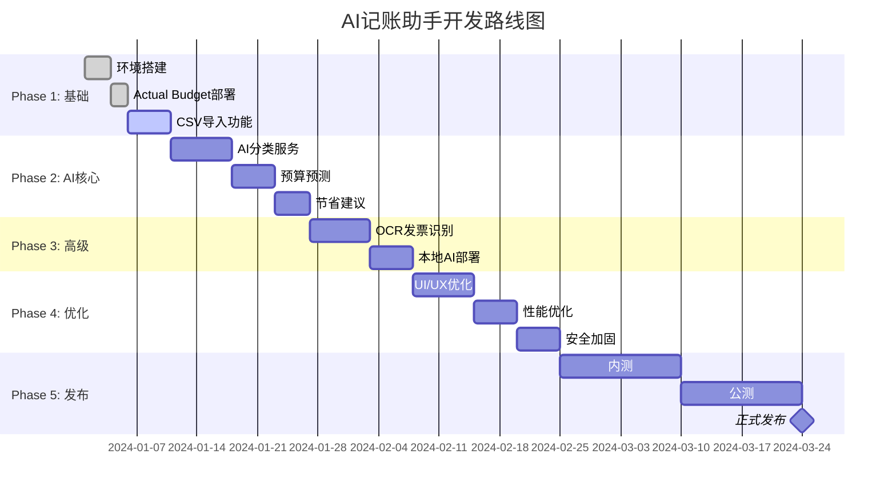

# AI记账助手 - 分阶段开发路线图

## 项目概述

基于 Actual Budget 开源项目的 AI 增强版个人记账助手，实现智能分类、预算预测、发票识别等功能。

---

## 阶段规划总览



---

## Phase 1: 基础架构搭建（第1-2周）

### 目标
- 完成开发环境搭建
- 部署 Actual Budget
- 实现基础数据导入功能

### 任务清单

#### Week 1: 环境准备

| 天数 | 任务 | 产出 | 备注 |
|-----|------|------|------|
| Day 1-2 | 项目初始化 | Monorepo结构、CI/CD配置 | 使用Turborepo |
| Day 3 | Actual Budget部署 | Docker环境运行 | 本地开发环境 |
| Day 4-5 | API集成测试 | 连接Actual API测试 | 验证数据读写 |

#### Week 2: 数据导入

| 天数 | 任务 | 产出 | 备注 |
|-----|------|------|------|
| Day 1-2 | 支付宝CSV解析器 | 支持标准导出格式 | 测试多种CSV格式 |
| Day 3-4 | 微信CSV解析器 | 支持微信账单CSV | 处理GBK编码 |
| Day 5 | 去重逻辑 | 基于ID去重 | 防止重复导入 |

### 技术要点
```typescript
// 核心：CSV解析 + Actual Budget写入
const importService = {
  async importAlipay(file: File) {
    const transactions = await alipayParser.parse(file);
    const uniqueTxs = deduplicate(transactions);
    return await actualAPI.addTransactions(uniqueTxs);
  }
};
```

### 里程碑 ✅
- [ ] Actual Budget成功部署
- [ ] 支付宝/微信CSV导入正常
- [ ] 数据正确写入Actual Budget

---

## Phase 2: AI核心功能（第3-5周）

### 目标
- 实现AI自动分类
- 预算预测
- 节省建议

### 任务清单

#### Week 3: AI分类服务

| 天数 | 任务 | 产出 | 备注 |
|-----|------|------|------|
| Day 1-2 | OpenAI集成 | 云端AI分类 | GPT-3.5-turbo |
| Day 3 | 规则引擎 | 关键词匹配 | 提高准确率 |
| Day 4-5 | 混合策略 | 规则+AI | 高置信度优先 |

#### Week 4: 预算预测

| 天数 | 任务 | 产出 | 备注 |
|-----|------|------|------|
| Day 1-2 | 历史数据分析 | 月度聚合 | 时序数据处理 |
| Day 3-4 | 预测算法 | AI预测接口 | 考虑季节性 |
| Day 5 | 可视化 | 预算建议UI | 展示预测结果 |

#### Week 5: 节省建议

| 天数 | 任务 | 产出 | 备注 |
|-----|------|------|------|
| Day 1-2 | 消费分析 | 异常检测 | 识别不必要支出 |
| Day 3-4 | 建议生成 | AI建议接口 | 个性化建议 |
| Day 5 | 建议展示 | 建议卡片UI | 可操作建议 |

### 技术要点
```typescript
// 混合分类策略
async function categorize(transaction: Transaction) {
  // 1. 规则匹配（最高优先级）
  const ruleMatch = ruleEngine.match(transaction);
  if (ruleMatch.confidence > 0.9) return ruleMatch;
  
  // 2. 本地AI（Ollama）
  const localResult = await ollama.categorize(transaction);
  if (localResult.confidence > 0.8) return localResult;
  
  // 3. 云端AI兜底
  return await openai.categorize(transaction);
}
```

### 里程碑 ✅
- [ ] AI分类准确率 > 80%
- [ ] 预算预测功能可用
- [ ] 节省建议合理可行

---

## Phase 3: 高级功能（第6-7周）

### 目标
- OCR发票识别
- 本地AI部署

### 任务清单

#### Week 6: OCR发票识别（多模态大模型API）

| 天数 | 任务 | 产出 | 备注 |
|-----|------|------|------|
| Day 1-2 | **Kimi Coding K2.5集成** ⭐ | 默认OCR方案 | **免费**，中文发票识别能力强 |
| Day 3-4 | Moonshot/OpenAI/Claude集成 | 备选方案 | 降级策略 |
| Day 5-7 | 发票信息提取 | 结构化数据 | 金额/日期/商家/商品 |

#### Week 7: AI功能优化与扩展

| 天数 | 任务 | 产出 | 备注 |
|-----|------|------|------|
| Day 1-2 | 批量OCR优化 | 批量处理接口 | 降低成本 |
| Day 3-4 | 错误处理与重试 | 稳定性提升 | 降级策略 |
| Day 5 | 多模型对比 | 效果评估 | 选择最优模型 |

### 技术要点
```typescript
// 多模态OCR服务 - 默认使用 Kimi Coding K2.5（免费）
class MultimodalOCRService {
  async recognize(imageBase64: string, provider: 'kimi-coding' | 'moonshot' | 'openai' | 'claude' = 'kimi-coding') {
    switch (provider) {
      case 'kimi-coding':
        return await this.kimiCodingVision(imageBase64);
      case 'moonshot':
        return await this.moonshotVision(imageBase64);
      case 'openai':
        return await this.gpt4Vision(imageBase64);
      case 'claude':
        return await this.claudeVision(imageBase64);
    }
  }
  
  // 默认：Kimi Coding K2.5（免费，中文发票识别效果最佳）⭐
  private async kimiCodingVision(imageBase64: string) {
    const response = await kimiCoding.chat.completions.create({
      model: 'kimi-coding/k2.5',  // Kimi Coding 专用端点
      baseURL: 'https://api.kimi.com/coding/v1',
      messages: [{
        role: 'user',
        content: [
          { type: 'text', text: '提取发票信息...' },
          { type: 'image_url', image_url: { url: `data:image/jpeg;base64,${imageBase64}` } }
        ]
      }]
    });
    return this.parseResult(response);
  }
  
  // 备选：Moonshot Kimi
  private async moonshotVision(imageBase64: string) {
    const response = await moonshot.chat.completions.create({
      model: 'kimi-k2.5',
      baseURL: 'https://api.moonshot.cn/v1',
      messages: [{
        role: 'user',
        content: [
          { type: 'text', text: '提取发票信息...' },
          { type: 'image_url', image_url: { url: `data:image/jpeg;base64,${imageBase64}` } }
        ]
      }]
    });
    return this.parseResult(response);
  }
  
  // 备选：OpenAI GPT-4o
  private async gpt4Vision(imageBase64: string) {
    const response = await openai.chat.completions.create({
      model: 'gpt-4o',
      messages: [{
        role: 'user',
        content: [
          { type: 'text', text: '提取发票信息...' },
          { type: 'image_url', image_url: { url: `data:image/jpeg;base64,${imageBase64}` } }
        ]
      }]
    });
    return this.parseResult(response);
  }
  
  // 备选：Claude 3
  private async claudeVision(imageBase64: string) {
    const response = await anthropic.messages.create({
      model: 'claude-3-sonnet-20240229',
      max_tokens: 1024,
      messages: [{
        role: 'user',
        content: [
          { type: 'text', text: '提取发票信息...' },
          { type: 'image', source: { type: 'base64', media_type: 'image/jpeg', data: imageBase64 } }
        ]
      }]
    });
    return this.parseResult(response);
  }
}
```

### 里程碑 ✅
- [ ] 发票识别可用（**Kimi Coding K2.5 免费** + 备选方案）
- [ ] 多服务商自动降级
- [ ] 中文发票识别准确率达标

---

## Phase 4: 优化完善（第8-10周）

### 目标
- UI/UX优化
- 性能优化
- 安全加固

### 任务清单

#### Week 8: UI/UX优化

| 天数 | 任务 | 产出 | 备注 |
|-----|------|------|------|
| Day 1-2 | 设计系统 | 组件库 | 统一风格 |
| Day 3-5 | 交互优化 | 动画/反馈 | 用户体验 |
| Day 6-7 | 响应式适配 | 移动端 | 手机友好 |

#### Week 9: 性能优化

| 天数 | 任务 | 产出 | 备注 |
|-----|------|------|------|
| Day 1-2 | 批量处理 | 并发优化 | 大数据量导入 |
| Day 3-4 | 缓存策略 | Redis缓存 | 减少API调用 |
| Day 5-7 | 前端优化 | 懒加载/虚拟列表 | 流畅体验 |

#### Week 10: 安全加固

| 天数 | 任务 | 产出 | 备注 |
|-----|------|------|------|
| Day 1-2 | 数据加密 | 敏感字段加密 | AES-256 |
| Day 3-4 | 审计日志 | 操作日志 | 可追溯 |
| Day 5-7 | 安全测试 | 漏洞修复 | 渗透测试 |

### 技术要点
```typescript
// 性能优化：批量处理
async function batchImport(transactions: Transaction[]) {
  const batchSize = 100;
  const batches = chunk(transactions, batchSize);
  
  for (const batch of batches) {
    await Promise.all(batch.map(t => actualAPI.addTransaction(t)));
    await delay(100); // 避免限流
  }
}
```

### 里程碑 ✅
- [ ] UI/UX达到可发布水平
- [ ] 导入1000条交易 < 10秒
- [ ] 通过基础安全审计

---

## Phase 5: 测试发布（第11-14周）

### 目标
- 内部测试
- 公测
- 正式发布

### 任务清单

#### Week 11-12: 内测

| 任务 | 参与人员 | 产出 |
|-----|---------|------|
| 功能测试 | 开发团队 | Bug列表 |
| 用户测试 | 5-10位朋友 | 反馈报告 |
| 合规检查 | 法务顾问 | 合规报告 |
| 文档完善 | 技术写作 | 使用文档 |

#### Week 13-14: 公测

| 任务 | 参与人员 | 产出 |
|-----|---------|------|
| Beta发布 | 公开用户 | 用户反馈 |
| 问题修复 | 开发团队 | 补丁版本 |
| 性能监控 | 运维 | 监控报告 |
| 准备发布 | 全员 | 发布检查清单 |

### 发布检查清单

```markdown
## 发布前检查清单

### 功能检查
- [ ] 支付宝/微信CSV导入正常
- [ ] AI分类准确率达标
- [ ] 预算预测功能可用
- [ ] 发票识别功能正常
- [ ] 数据同步无误

### 合规检查
- [ ] 隐私政策已发布
- [ ] 用户协议已更新
- [ ] 免责声明已显示

### 技术检查
- [ ] 所有测试通过
- [ ] 安全审计通过
- [ ] 性能指标达标
- [ ] 日志监控到位
- [ ] 备份策略生效

### 文档检查
- [ ] 使用文档完整
- [ ] API文档更新
- [ ] 部署文档可用
- [ ] 常见问题FAQ
```

### 里程碑 ✅
- [ ] 内测Bug修复完成
- [ ] 公测用户反馈良好
- [ ] 正式发布上线

---

## 资源需求

### 开发团队

| 角色 | 人数 | 阶段 | 职责 |
|-----|------|------|------|
| 全栈开发 | 1-2人 | 全程 | 核心功能开发 |
| AI工程师 | 0.5人 | Phase 2-3 | AI功能调优 |
| UI设计师 | 0.5人 | Phase 4 | 界面设计 |
| 产品经理 | 0.5人 | 全程 | 需求管理 |
| 法务顾问 | 按需 | Phase 1,5 | 合规审核 |

### 基础设施成本（月度）

| 项目 | 开发期 | 运营期 | 备注 |
|-----|--------|--------|------|
| Kimi Coding API ⭐ | **免费** | **免费** | OCR识别（**默认免费**） |
| Moonshot Kimi API | ¥100-300 | ¥300-1000 | AI分类（备选） |
| 服务器 | ¥100-300 | ¥500-1000 | 云服务 |
| 域名+CDN | ¥50 | ¥100-200 | - |
| 合计 | ¥250-750 | ¥900-2200 | - |

---

## 风险与应对

### 技术风险

| 风险 | 概率 | 影响 | 应对 |
|-----|------|------|------|
| AI分类准确率不达预期 | 中 | 高 | 引入规则引擎兜底 |
| OCR识别率低 | 中 | 中 | 多服务商切换方案 |
| Actual Budget API变更 | 低 | 高 | 关注官方更新 |

### 合规风险

| 风险 | 概率 | 影响 | 应对 |
|-----|------|------|------|
| 数据隐私投诉 | 低 | 中 | 数据加密存储、用户授权明确 |
| 发票数据安全 | 低 | 中 | 云端OCR使用可信服务商 |

### 进度风险

| 风险 | 概率 | 影响 | 应对 |
|-----|------|------|------|
| 开发延期 | 中 | 中 | 优先级管理，MVP先行 |
| 人员变动 | 低 | 高 | 文档完善，知识共享 |

---

## 成功指标

### 技术指标
- AI分类准确率 > 80%
- 发票识别准确率 > 85%
- 页面加载时间 < 2秒
- 并发用户支持 > 100

### 业务指标
- 日活跃用户 > 100（发布3个月）
- 用户留存率 > 40%（7日）
- 用户满意度 > 4.0/5.0

---

## 下一步行动

1. **立即开始**：Phase 1 - 环境搭建
2. **本周完成**：Actual Budget部署 + API测试
3. **准备事项**：
   - [ ] 注册域名
   - [ ] 准备服务器
   - [ ] 申请OpenAI API Key
   - [ ] 咨询法务顾问

---

**预计总工期：14周（约3.5个月）**
**预计发布日期：2024年4月中旬**